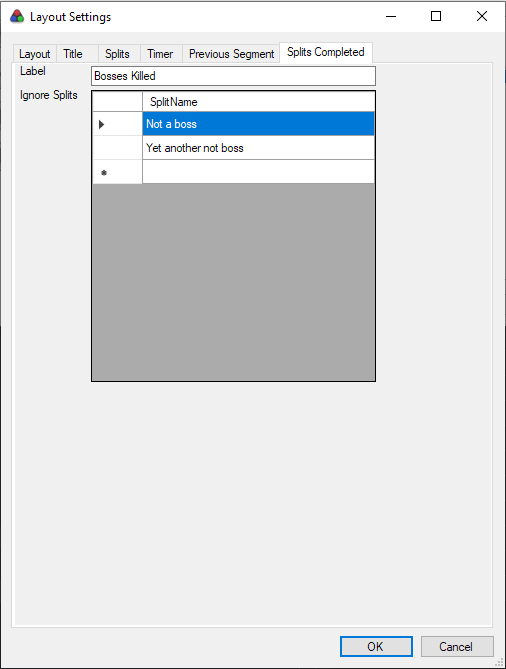
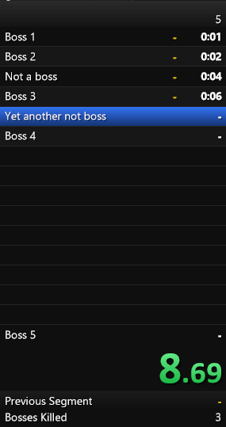

# For users

This is a LiveSplit component that makes it easy to track the number of splits that you've completed. You can also provide a list of splits names to ignore.

Example use cases:
- Boss counter where each boss has its own split (ignoring splits unrelated to bosses)

## Notes

* To add an ignored split, edit the cell to the right of the asterisk `*`.
* To delete an ignored split, click the cell to the left of the split name and press the `Delete` key (not backspace!).
* If you update the label and a run isn't ongoing, the label won't update until you either start a run or restart LiveSplit.

## Releases

Releases are available in the Releases tab.

## Screenshots

_Layout settings_

_Appearance in splits_

# For developers

You will need the LiveSplit source somewhere on your computer. Edit references in `LiveSplit.SplitCounter.sln` and `LiveSplit.SplitCounter.csproj` to point to the csproj in `LiveSplit.Core` and `UpdateManager`.

Based on the tutorial at [https://gist.github.com/TheSoundDefense/cf85fd68ae582faa5f1cc95f18bba4ec](), so that may be useful as a reference.